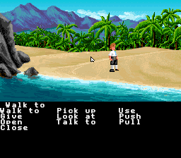
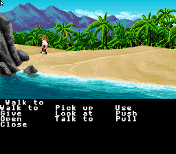

# SNES Super Monkey Island

A native SCUMM v5 interpreter for *The Secret of Monkey Island* on the Super Nintendo, using MSU-1 for asset streaming.

| | |
|:---:|:---:|
|  |  |
| Beach with OCHR object rendering (rocks, shoreline) | SCUMM Bar background |
|  |  |
| Full verb bar with HDMA palette split | Guybrush scaled down near rocks via SA-1 CC Type 2 |
|  |  |
|  |  |
|  |  |

## Architecture

- **Language**: 65816 assembly with a custom OOP framework
- **Platform**: SNES + MSU-1 (SD2SNES / FXPAK Pro)
- **Target**: MI1 VGA CD Talkie (`monkey.000` / `monkey.001`)
- **Input**: SNES Mouse (primary), joypad with virtual cursor (fallback)
- **Audio**: SPC700 native chip music + SFX via [Terrific Audio Driver](https://github.com/undisbeliever/terrific-audio-driver), MSU-1 for voice acting
- **Assembler**: WLA-DX v9.3 (v9.4+ breaks the build)
- **Engine base**: Forked from Super Dragon's Lair Arcade (SNES MSU-1)

## Approach

Following the GBAGI model (Brian Provinciano's native AGI interpreter for GBA): a purpose-built, hardware-native interpreter that reads original game data files. Not a ScummVM port.

The SNES ROM is just the engine. All game assets live in an MSU-1 data pack generated offline from the user's own MI1 data files (`monkey.000` / `monkey.001`).

MSU-1 provides unlimited storage (4GB addressable) with on-demand streaming. VRAM and WRAM act as live caches backed by MSU-1, the same proven architecture used by the Super Dragon's Lair SNES port for continuous FMV playback.

## Build

Build runs under WSL with WLA-DX v9.3:

```bash
# Standard build (clean + build)
wsl -e bash -c "cd /mnt/e/gh/SNES-SuperMonkeyIsland && make clean && make"

# Output: build/SuperMonkeyIsland.sfc (also copied to distribution/)
```

## Offline Pipeline Tools

The `tools/` directory contains Python tools that convert MI1 data into SNES-native format:

| Tool | Purpose |
|------|---------|
| `scumm_extract.py` | Extract all MI1 resources (rooms, scripts, costumes, sounds, charsets) |
| `scumm_costume_decoder.py` | Decode SCUMM v5 costume RLE data into indexed pixel arrays |
| `snes_costume_converter.py` | Convert decoded costumes to SNES 4bpp sprite tiles + OAM layout |
| `snes_room_converter.py` | Convert room backgrounds to SNES 4bpp tilesets + tilemaps (tile-aware palette optimization) |
| `msu1_pack_rooms.py` | Pack all converted rooms into MSU-1 data file |
| `msu1_pack_scripts.py` | Pack all script bytecode into MSU-1 data file (appends to room pack) |
| `scumm_opcode_audit.py` | Walk all 748 script files, decode bytecode, report opcode coverage |
| `gen_dispatch_table.py` | Generate 256-entry 65816 opcode dispatch table from Python opcode map |
| `fxpak_push.py` | Push ROM to FXPAK Pro via QUsb2Snes |
| `fxpak_debug.py` | Live WRAM inspector for FXPAK Pro debugging |
| `fxpak_crash_dump.py` | Post-crash memory dump from FXPAK Pro |
| `smi_workflow_server.py` | Project-scoped MCP server (`smi-workflow` namespace): build, validate, run_test, screenshot, sym lookup |
| `mesen_inproc_bridge.py` | Bridge to Mesen2 `--mcp` long-lived debugger MCP server (`mesen-inproc` namespace) |
| `tad/tad-compiler.exe` | Terrific Audio Driver compiler — MML + WAV → SPC700 binary blob |

## Legal Model

Engine distributed separately from game data (like GBAGI). Users supply their own copy of Monkey Island.

## Reusable Modules

The `tools/scumm/` package contains reusable SCUMM v5 modules:

| Module | Purpose |
|--------|---------|
| `opcodes_v5.py` | Complete 256-entry opcode table with variable-length parameter decoders |

## Status

**Phases 0-2 complete, Phase 3 in progress** — SCUMM v5 interpreter running, full actor system with SA-1 hardware scaling, OCHR object rendering, verb interaction, walkbox pathfinding.

### Rendering Pipeline
- All 86 MI1 rooms extracted, converted, and packed into MSU-1 data (2.52 MB)
- 896-slot VRAM tile cache with MSU-1 random-access streaming
- Smooth horizontal scrolling with background column refresh
- **NMI tile transfer via DMA channel 7** — 4x faster than CPU register writes, handles 20+ tiles per VBlank
- **OCHR object rendering** — SCUMM setState triggers tile overlay apply/remove with instant forced-blank redraw
- Deferred brightness restore — screen stays dark during room load, turns on only after ENCD scripts + OCHR patches are fully applied

### Actor System + SA-1 Hardware Scaling
The actor scaling system went through a notable evolution. Early prototypes explored a SuperFX chip approach for real-time sprite scaling, but the SuperFX's limited throughput couldn't handle multi-actor scenes at 60fps. The solution: **SA-1 co-processor with Character Conversion Type 2** — a hardware-assisted bitmap-to-tile converter that the SA-1 provides but almost no commercial game ever used.

The pipeline: body + head costume tiles are composited into a BW-RAM pixel buffer, nearest-neighbor scaled to the target size, then CC Type 2 converts the scaled bitmap back to SNES 4bpp tile format in SA-1 I-RAM. The SNES CPU DMAs the result to VRAM. Non-blocking: the SA-1 runs the scaler asynchronously while the SNES CPU continues game logic. Results are cached per-actor until the animation frame or scale factor changes.

### Interpreter
- All 105 SCUMM v5 opcodes implemented (103 used by MI1)
- 25 concurrent script slots, 44KB bytecode cache in bank $7F
- Multi-room navigation: 15/15 rooms pass smoke test

### Additional Systems
- **Verb bar** — 10 MI1 verbs on BG2 with HDMA palette split, yellow highlight on hover
- **Dialog** — BG3 text overlay, per-actor talk colors, auto-timed display
- **Walkbox pathfinding** — full SCUMM v5 walkbox system with A* routing
- **Object interaction** — findObject AABB, doSentence/startObject execution, OBCD VERB pipeline
- **Audio** — Terrific Audio Driver (TAD) v0.2.0 on SPC700, SCUMM sound opcodes wired
- **BW-RAM infrastructure** — save header, CGRAM shadow, darkenPalette, setPalColor
- **SA-1 co-processor** — CC Type 2 sprite scaling, BW-RAM composite buffer, non-blocking pipeline

### Next Milestones
- Costume pipeline: 123 costumes need conversion (only costume 1 done)
- Cutscene system: beginOverride/endOverride + ESC skip
- SPC700 music: MI1 tracks arranged as MML for TAD
