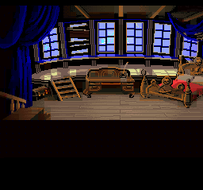
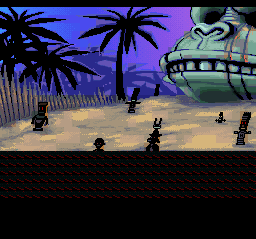

# SNES Super Monkey Island

A native SCUMM v5 interpreter for *The Secret of Monkey Island* on the Super Nintendo, using MSU-1 for asset streaming.

| | |
|:---:|:---:|
|  |  |
|  |  |

## Architecture

- **Language**: 65816 assembly with a custom OOP framework
- **Platform**: SNES + MSU-1 (SD2SNES / FXPAK Pro)
- **Target**: MI1 VGA CD Talkie (`monkey.000` / `monkey.001`)
- **Input**: SNES Mouse (primary), joypad with virtual cursor (fallback)
- **Audio**: MSU-1 PCM for music, SPC700 for sound effects
- **Assembler**: WLA-DX v9.3 (v9.4+ breaks the build)
- **Engine base**: Forked from Super Dragon's Lair Arcade (SNES MSU-1)

## Approach

Following the GBAGI model (Brian Provinciano's native AGI interpreter for GBA): a purpose-built, hardware-native interpreter that reads original game data files. Not a ScummVM port.

The SNES ROM is just the engine. All game assets live in an MSU-1 data pack generated offline from the user's own MI1 data files (`monkey.000` / `monkey.001`).

MSU-1 provides unlimited storage (4GB addressable) with on-demand streaming. VRAM and WRAM act as live caches backed by MSU-1, the same proven architecture used by the Super Dragon's Lair SNES port for continuous FMV playback.

## Build

Build runs under WSL with WLA-DX v9.3:

```bash
# Standard build (clean + build)
wsl -e bash -c "cd /mnt/e/gh/SNES-SuperMonkeyIsland && make clean && make"

# Output: build/SuperMonkeyIsland.sfc (also copied to distribution/)
```

## Offline Pipeline Tools

The `tools/` directory contains Python tools that convert MI1 data into SNES-native format:

| Tool | Purpose |
|------|---------|
| `scumm_extract.py` | Extract all MI1 resources (rooms, scripts, costumes, sounds, charsets) |
| `snes_room_converter.py` | Convert room backgrounds to SNES 4bpp tilesets + tilemaps |
| `msu1_pack_rooms.py` | Pack all converted rooms into MSU-1 data file |
| `msu1_pack_scripts.py` | Pack all script bytecode into MSU-1 data file (appends to room pack) |
| `scumm_opcode_audit.py` | Walk all 748 script files, decode bytecode, report opcode coverage |
| `gen_dispatch_table.py` | Generate 256-entry 65816 opcode dispatch table from Python opcode map |
| `fxpak_push.py` | Push ROM to FXPAK Pro via QUsb2Snes |
| `fxpak_debug.py` | Live WRAM inspector for FXPAK Pro debugging |
| `fxpak_crash_dump.py` | Post-crash memory dump from FXPAK Pro |

## Legal Model

Engine distributed separately from game data (like GBAGI). Users supply their own copy of Monkey Island.

## Reusable Modules

The `tools/scumm/` package contains reusable SCUMM v5 modules:

| Module | Purpose |
|--------|---------|
| `opcodes_v5.py` | Complete 256-entry opcode table with variable-length parameter decoders |

## Status

**Phase 0 complete** — room rendering and scroll streaming fully operational.

- All 86 MI1 rooms extracted, converted, and packed into MSU-1 data (2.52 MB)
- Rooms display correctly on SNES via Mode 1 BG1 with per-room adaptive palettes
- 896-slot VRAM tile cache with MSU-1 random-access streaming
- Smooth horizontal scrolling with background column refresh (handles ring buffer eviction on scroll reversal)
- Room cycling via L/R buttons with fade transitions — all 86 rooms browsable
- 14 rooms exceeding 1024 unique tiles handled correctly via tile cache + 11-bit tile IDs

**Phase 1 in progress** — SCUMM v5 bytecode interpreter boots MI1.

- Opcode audit complete: 103 of 105 base opcodes used by MI1 (only `getAnimCounter` and `getInventoryCount` unused)
- 748 scripts analyzed (30,066 opcodes decoded, 0 decode errors)
- Full opcode table with variable-length parameter decoders built (`tools/scumm/opcodes_v5.py`)
- All 748 scripts packed into MSU-1 data (380 KB bytecode, indexed by script number and room)
- Pipeline: `msu1_pack_rooms.py` → `msu1_pack_scripts.py` → 2.89 MB data pack
- **Dispatch engine built** — 256-entry jump table, per-frame scheduler for 25 concurrent script slots
- **All 105 base opcodes implemented** — control flow, conditionals, arithmetic, script management, variables, room/object/actor/sound/verb operations, print/string handling, expression evaluation, and more
- Variable system: 800 global vars, 25 local vars per slot, 2048 bit vars
- 32 KB script cache in bank $7F with MSU-1 on-demand loading
- ScummVM OOP singleton object: boots MI1 script 1 from MSU-1, runs scheduler in play loop
- **MI1 boots and renders room 1** — SCUMM interpreter runs boot scripts, triggers room load via Phase 0 pipeline, beach scene displays correctly
- **Room scripts loaded on room change** — ENCD/EXCD/LSCR bytecode parsed from MSU-1 data, cached in $7F, ENCD auto-started in a script slot. Local scripts (200+) routed via LSCR table lookup.
- **Multi-room smoke test** (`distribution/test_multiroom.lua`) — rooms 1, 2, 3 PASS with room scripts executing to completion
- Known issue: room 4 E_Brk crash (expression handler stack corruption after room 83 scripts)
- Next: debug expression handler, actor placement, verb bar
