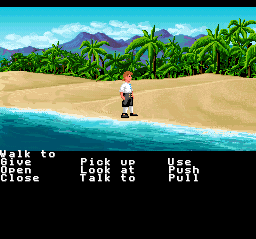
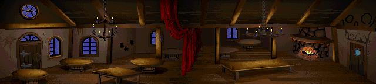
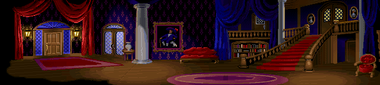
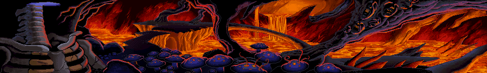

# SNES Super Monkey Island

A native SCUMM v5 interpreter for *The Secret of Monkey Island* on the Super Nintendo, using MSU-1 for asset streaming.

| | |
|:---:|:---:|
|  |  |
| Guybrush on the beach with full verb bar | SCUMM Bar background |
|  |  |
|  |  |
|  |  |

## Architecture

- **Language**: 65816 assembly with a custom OOP framework
- **Platform**: SNES + MSU-1 (SD2SNES / FXPAK Pro)
- **Target**: MI1 VGA CD Talkie (`monkey.000` / `monkey.001`)
- **Input**: SNES Mouse (primary), joypad with virtual cursor (fallback)
- **Audio**: SPC700 native chip music + SFX via [Terrific Audio Driver](https://github.com/undisbeliever/terrific-audio-driver), MSU-1 for voice acting
- **Assembler**: WLA-DX v9.3 (v9.4+ breaks the build)
- **Engine base**: Forked from Super Dragon's Lair Arcade (SNES MSU-1)

## Approach

Following the GBAGI model (Brian Provinciano's native AGI interpreter for GBA): a purpose-built, hardware-native interpreter that reads original game data files. Not a ScummVM port.

The SNES ROM is just the engine. All game assets live in an MSU-1 data pack generated offline from the user's own MI1 data files (`monkey.000` / `monkey.001`).

MSU-1 provides unlimited storage (4GB addressable) with on-demand streaming. VRAM and WRAM act as live caches backed by MSU-1, the same proven architecture used by the Super Dragon's Lair SNES port for continuous FMV playback.

## Build

Build runs under WSL with WLA-DX v9.3:

```bash
# Standard build (clean + build)
wsl -e bash -c "cd /mnt/e/gh/SNES-SuperMonkeyIsland && make clean && make"

# Output: build/SuperMonkeyIsland.sfc (also copied to distribution/)
```

## Offline Pipeline Tools

The `tools/` directory contains Python tools that convert MI1 data into SNES-native format:

| Tool | Purpose |
|------|---------|
| `scumm_extract.py` | Extract all MI1 resources (rooms, scripts, costumes, sounds, charsets) |
| `scumm_costume_decoder.py` | Decode SCUMM v5 costume RLE data into indexed pixel arrays |
| `snes_costume_converter.py` | Convert decoded costumes to SNES 4bpp sprite tiles + OAM layout |
| `snes_room_converter.py` | Convert room backgrounds to SNES 4bpp tilesets + tilemaps (tile-aware palette optimization) |
| `msu1_pack_rooms.py` | Pack all converted rooms into MSU-1 data file |
| `msu1_pack_scripts.py` | Pack all script bytecode into MSU-1 data file (appends to room pack) |
| `scumm_opcode_audit.py` | Walk all 748 script files, decode bytecode, report opcode coverage |
| `gen_dispatch_table.py` | Generate 256-entry 65816 opcode dispatch table from Python opcode map |
| `fxpak_push.py` | Push ROM to FXPAK Pro via QUsb2Snes |
| `fxpak_debug.py` | Live WRAM inspector for FXPAK Pro debugging |
| `fxpak_crash_dump.py` | Post-crash memory dump from FXPAK Pro |
| `mesen_mcp_server.py` | MCP server for Mesen 2 automation: symbol lookup, build, test, screenshots |
| `tad/tad-compiler.exe` | Terrific Audio Driver compiler — MML + WAV → SPC700 binary blob |

## Legal Model

Engine distributed separately from game data (like GBAGI). Users supply their own copy of Monkey Island.

## Reusable Modules

The `tools/scumm/` package contains reusable SCUMM v5 modules:

| Module | Purpose |
|--------|---------|
| `opcodes_v5.py` | Complete 256-entry opcode table with variable-length parameter decoders |

## Status

**Phase 0 complete** — room rendering and scroll streaming fully operational.

- All 86 MI1 rooms extracted, converted, and packed into MSU-1 data (2.52 MB)
- Rooms display correctly on SNES via Mode 1 BG1 with tile-aware optimized palettes (joint tile-palette assignment, perceptual color weighting)
- 896-slot VRAM tile cache with MSU-1 random-access streaming
- Smooth horizontal scrolling with background column refresh (handles ring buffer eviction on scroll reversal)
- Room cycling via L/R buttons with fade transitions — all 86 rooms browsable
- 14 rooms exceeding 1024 unique tiles handled correctly via tile cache + 11-bit tile IDs

**Phase 1 complete, Phase 2 in progress** — SCUMM v5 interpreter running, actor + verb systems operational.

- Opcode audit complete: 103 of 105 base opcodes used by MI1 (only `getAnimCounter` and `getInventoryCount` unused)
- 748 scripts analyzed (30,066 opcodes decoded, 0 decode errors)
- Full opcode table with variable-length parameter decoders built (`tools/scumm/opcodes_v5.py`)
- All 748 scripts packed into MSU-1 data (380 KB bytecode, indexed by script number and room)
- Pipeline: `msu1_pack_rooms.py` → `msu1_pack_scripts.py` → 2.89 MB data pack
- **Dispatch engine built** — 256-entry jump table, per-frame scheduler for 25 concurrent script slots
- **All 105 base opcodes implemented** — control flow, conditionals, arithmetic, script management, variables, room/object/actor/sound/verb operations, print/string handling, expression evaluation, and more
- Variable system: 800 global vars, 25 local vars per slot, 2048 bit vars
- 44 KB script cache in bank $7F with MSU-1 on-demand loading
- ScummVM OOP singleton object: boots MI1 script 1 from MSU-1, runs scheduler in play loop
- **MI1 boots and renders room 1** — SCUMM interpreter runs boot scripts, triggers room load via Phase 0 pipeline, beach scene displays correctly
- **Room scripts loaded on room change** — ENCD/EXCD/LSCR bytecode parsed from MSU-1 data, cached in $7F, ENCD auto-started in a script slot. Local scripts (200+) routed via LSCR table lookup.
- **Multi-room navigation works** — 15/15 rooms pass smoke test (rooms 1, 2, 3, 4, 5, 7, 10, 12, 15, 20, 25, 30, 35, 40, 50), including redirect chains (3→83, 4→83, 5→83)
- **Expression evaluator fixed** — stack-based RPN expression handler with correct sub-opcode dispatch, signed 16-bit multiply/divide
- **Global script cache reload on room change** — surviving GLOBAL script slots get fresh cache positions after cache flush, preventing stale pointer crashes
- **Audio engine integrated** — Terrific Audio Driver (TAD) v0.2.0 replaces legacy SPC700 MOD player
  - TAD init at boot, per-frame processing in main loop, SPC700 driver active and playing
  - SCUMM sound opcodes (`startMusic`, `startSound`, `stopMusic`, `stopSound`, `isSoundRunning`) wired to TAD API
  - MSU-1 PCM audio fallback path for music playback
  - MML composition pipeline ready — songs in `audio/songs/`, samples in `audio/samples/`, compiled by `tad-compiler`
- **Guybrush walking on beach** — costume decoder (RLE with cross-column carry), SNES 4bpp tile converter, OAM renderer with 16-bit coordinate math, VBlank DMA via engine queue
  - OAM Table 1 (high X bit + size select) properly maintained
  - Sprite transparency working — color 0 pixels correctly transparent
  - Costume 17 (Guybrush standing/walking) renders with correct palette: white shirt, dark pants, brown hair, skin tones
- **Walking animation** — Guybrush moves and animates with a 12-step walk cycle
  - `walkActorTo` sets walk targets in parallel WRAM arrays (no longer instant teleport)
  - `updateActors`: per-frame movement (2px/frame), direction from dx/dy, animation timer
  - `renderActors`: dynamic frame lookup via costume frame tables, CHR DMA on frame change
  - Heavy rendering code in superfree section (jsl/rtl) to avoid bank 0 linker overflow
- **Verb bar rendering** — all 10 MI1 verbs displayed on BG2 with font tile DMA
  - BG2 (32x32 tilemap) dedicated to verb/UI layer, BG1 for room backgrounds
  - 4bpp font tiles DMA'd to VRAM on room init, verb palette to CGRAM after room palette
  - Verb tilemap renderer: iterates verb slots, builds tilemap in WRAM, DMA to VRAM
  - Priority bit on BG2 tiles ensures verbs render above BG1's room tiles
  - `verbOps` opcode handler: set verb name, position, flags, on/off state
  - `initDefaultVerbs`: hardcoded MI1 verb layout (Walk to, Give, Open, Close, Pick up, Look at, Talk to, Use, Push, Pull)
- **HDMA verb area split** — per-scanline BG1 disable + CGRAM palette swap at scanline boundary
  - Channel 1: disables BG1 below scanline 144 (TM register) so verb area shows only BG2
  - Channel 2: writes verb font palettes to CGRAM at scanline 137 (mode 3, targeting $2121/$2122)
  - 70-byte HDMA table in WRAM: restores room palette colors at top of frame, sets verb colors before verb area
- **Verb highlight** — hovered verb rendered in bright yellow, others in white
  - `updateCursor` hit-tests verb bounding boxes, stores highlighted slot in `SCUMM.highlightVerb`
  - `renderVerbBar` selects palette 6 (yellow, $03FF) for highlighted verb, palette 7 (white, $7FFF) for normal
  - Both palettes written per-scanline via HDMA — no CPU cost during active display
- **Virtual cursor + click-to-walk** — joypad D-pad moves an 8x8 OAM cursor sprite, A-button walks Guybrush
  - Cursor position tracked as SCUMM variables (VAR 42-45), 2px/frame movement
  - Click in room area (Y < 144) triggers `walkActorTo` for ego actor
  - Click in verb area triggers verb hover/selection
  - `cursorCommand` subops wired: cursor on/off/increment/userput
- **Dialog text on BG3** — SCUMM print/printEgo opcodes render text to BG3 tilemap in Mode 1 with BG3 priority
  - 2bpp font (ExcFontTiles) DMA'd to VRAM $A000, tilemap at $9800
  - Per-actor talk colors via SCUMM color LUT (16 EGA-standard colors → BGR555)
  - Auto-timed display (charCount * 6 + 60 frames), auto-clear
  - Sentence line on BG3 row 17: shows currently selected verb ("Walk to", "Open", etc.)
- **Walkbox pathfinding** — full SCUMM v5 walkbox system operational
  - BOXD/BOXM data loaded from MSU-1 room data, routing matrix built via createBoxMatrix
  - A* pathfinding through walkbox graph with waypoint arrays (8 waypoints per actor)
  - `walkActorTo`: builds walk path through connected boxes, falls back to straight-line if ignoreBoxes
  - `walkActorToActor`: reads target actor position, delegates to walkActorTo pathfinding
  - `isActorInBox`, `getActorWalkBox`, `actorOps` ignoreBoxes/followBoxes all wired
  - `matrixOps`: setBoxFlags/setBoxScale/setBoxSlot/createBoxMatrix opcodes functional
- **actorOps audit** — 14 of 19 sub-opcodes now store to real actor data
  - Struct fields: costume, initFrame, talkColor, elevation, scalex
  - WRAM parallel arrays (9 x 16B = 144B): width, walkSpeedX/Y, animSpeed, walkAnimNr, standFrame, talkAnimStart/End, zClip
  - Remaining stubs (5): sound, palette, palette2, actorName, shadow
- **Actor getters read real data** — getActorCostume/Facing/Elevation/Scale/Width/WalkBox all read struct fields or parallel arrays (no more hardcoded returns)
- **Object ownership** — objectOwner[1024] WRAM table with setOwnerOf/getObjectOwner opcodes
- **lights opcode** — stores luminance to VAR_CURRENT_LIGHTS (globalVars[72])
- **walkActorToActor** — reads target actor's position, builds walk path with full pathfinding
- **animateActor / faceActor** — store to actor struct fields (initFrame, facing)
- Next: mouse input, object interaction (drawObject, findObject), roomOps (palette fades, screen shake), full costume animation engine, MI1 music arrangements
